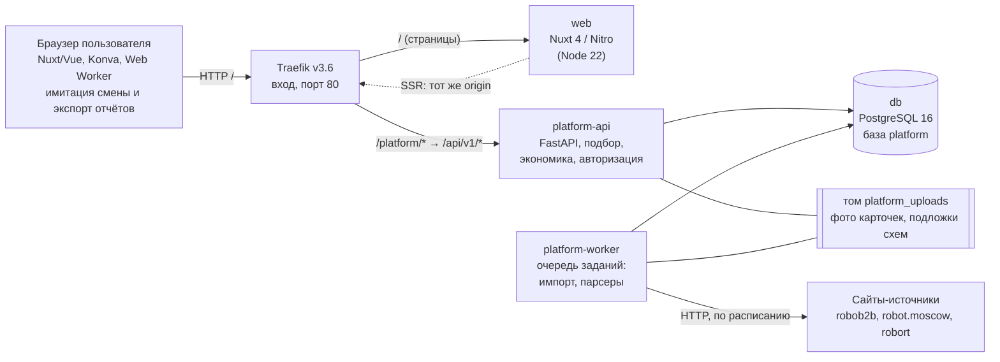
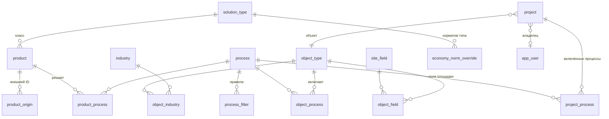

# Раздел 2. Архитектура решения

*Закрывает п. 6.3 ТЗ: схема компонентов, потоки данных, структура хранилища, описание API.*

## 2.1. Обзор

Решение состоит из пяти контейнеров под управлением Docker Compose. Расчёты подбора и экономики выполняются на сервере, чтобы формулы и нормативы жили в одном месте и не расходились с интерфейсом. Имитация работы роботов выполняется в браузере пользователя: это интерактивная 2D-сцена, которой нужны низкая задержка и локальная анимация.

Маршрутизация в Traefik: правило `PathPrefix('/')` с приоритетом 1 отдаёт страницы сервису `web`; правило `PathPrefix('/platform')` с приоритетом 20 снимает префикс `/platform` и передаёт запрос в `platform-api` (порт 8000). Поэтому все страницы и API доступны на одном origin (`http://localhost`), а cookie сессии не требует настройки CORS.

## 2.2. Компоненты

| Компонент | Технология | Ответственность |
|---|---|---|
| `web` | Nuxt 4.5 (Vue 3, Nitro, TypeScript), сборка `node:22-alpine` | Страницы каталога, мастер проекта, шаги подбора, экономики, визуализации и отчёта, админ-панель. Серверный рендеринг (SSR) для первой загрузки |
| `platform-api` | Python 3.12, FastAPI, SQLAlchemy 2, Alembic, psycopg 3 | REST API `/api/v1`. Подбор, экономика, проекты, справочники, авторизация. При старте выполняет `python -m app.bootstrap`: создаёт базу, применяет миграции, наполняет каталог |
| `platform-worker` | Тот же образ, команда `python -m app.bootstrap && python -m app.worker` | Забирает задания из таблицы `job` (`SELECT … FOR UPDATE SKIP LOCKED`), выполняет импорт CSV и парсеры, запускает парсеры по расписанию (час по Москве) |
| `db` | PostgreSQL 16 (alpine) | Единственное хранилище: каталог, справочники, правила, нормативы, проекты, пользователи, очередь заданий |
| `traefik` | Traefik v3.6 | Единая точка входа, маршрутизация по префиксу пути |
| Том `platform_uploads` | Docker volume | Загруженные фото карточек и подложки схем объектов. Общий для `platform-api` и `platform-worker` |
| Браузер | TypeScript, Konva, Web Worker, библиотека `pathfinding` | Имитация, редактор схемы, печать и выгрузка отчёта |

Слои внутри `platform/app`:

| Каталог | Роль |
|---|---|
| `api/` | Маршруты FastAPI: `main.py` (проекты, каталог, подбор, экономика), `auth.py`, `admin_catalog.py`, `admin_objects.py`, `admin_products.py` |
| `application/` | Прикладные сценарии: назначение процессов роботам, справочные данные, начальное наполнение |
| `domain/` | Логика без обращения к БД: `match.py` (подбор), `formula.py` (формулы количества), `economy.py` (экономика), `layout_items.py`, `solution_types.py`, разбор ТТХ и CSV |
| `infrastructure/db/` | Модели SQLAlchemy (`models.py`), репозитории (в том числе `taxonomy_repo.py`: проекты, сборка подбора и экономики) |
| `parsers/` | Парсеры сайтов `robob2b`, `robot_moscow`, `robort` |
| `bootstrap.py`, `worker.py` | Подготовка БД и очередь заданий |
| `normalize_catalog.py` | Аудит и нормализация каталога (раздел 7) |

## 2.3. Потоки данных

**Подбор.** Браузер отправляет `POST /projects/{id}/match` с параметрами площадки. Сервер читает из БД каталог, правила процесса и общий фильтр готовности, проходит по каждой паре «робот — процесс», формирует вердикт и причины и возвращает группы по процессам с `best_product_id`. Ничего не пишется в БД, результат вычисляется заново на каждый запрос (см. ограничение в разделе 12).

**Экономика.** Браузер отправляет `POST /projects/{id}/economy` с выбранными роботами (`picks`), допущениями (`choices`) и, при необходимости, значениями what-if (`preview`). Сервер читает нормативы и ручные значения проекта, считает три сценария и возвращает для каждой строки значение и формулу в LaTeX.

**Схема и имитация.** Схема расстановки хранится в проекте (`PUT /projects/{id}/layout`), подложка загружается отдельным запросом. Имитация целиком считается в браузере и на сервер не передаётся.

**Актуализация каталога.** Администратор загружает CSV или запускает парсер: API записывает задание в `job`, воркер берёт его, разбирает источник, записывает значения характеристик вместе с источником и выставляет статус. Ручные правки не затираются следующим импортом (раздел 7).

## 2.4. Структура хранилища

Хранилище: PostgreSQL 16, база `platform`. Схема (26 таблиц, включая служебную `alembic_version`) создаётся 14 миграциями Alembic (`0001…0014`, актуальная `0014_match_settings`). Полное описание таблиц и полей приведено в приложении Е. Здесь дана логическая структура.

Ключевые сущности:

| Сущность | Что хранит | Примечание |
|---|---|---|
| Иерархия «отрасль → объект → процесс → тип решения → продукт» | 13 отраслей, 18 объектов, 65 процессов, 85 типов, 555 продуктов | Связь продукта с процессом не привязана к дереву каталога: `in_match` управляет только участием объекта в подборе |
| Значения характеристик | 189 определений характеристик (`attribute_def`). Значения лежат в `product.attrs` (JSONB), ссылки на источники по каждому значению в `product.column_sources`, исходная строка каталога в `product.raw_catalog` | Источник: сайт, файл организатора, ручной ввод. Ручная правка помечается, следующий импорт её не затирает |
| Реестр источников | 605 записей (`source`) | Вид источника, издатель, URL, код парсера, заголовок |
| Правила подбора | 47 фильтров процессов, формулы количества по процессам, общий фильтр готовности | Правила редактируются в админке без изменений кода (раздел 9) |
| Нормативы экономики | Общие и по типам решений, с источником и журналом изменений | Значения по умолчанию заданы в коде; переопределения хранятся в БД (в чистой БД таблица нормативов пуста) |
| Проекты | Параметры площадки (`site`, JSONB; список ролей персонала лежит в нём под ключом `__tasks`), включённые процессы (`project_process`), ручные значения экономики (`economy_overrides`), схема расстановки (`layout`) | Демо-проекты отличаются признаками `is_demo` и `published` |
| Пользователи | Логин, роль, хеш пароля (argon2) | Три записи: `guest`, `user`, `admin` |
| Очередь заданий `job` | Тип, статус, журнал, время | Для импорта и парсеров |

Файлы: фото карточек (PNG, JPG, WebP до 10 МБ) и подложки схем (до 20 МБ) хранятся в каталоге `UPLOAD_DIR` (том `platform_uploads`), а в БД лежит только имя файла.

## 2.5. Безопасность и разграничение доступа

| Тема | Как устроено |
|---|---|
| Сессия | Подписанная cookie `platform_session`, `httpOnly`, `SameSite=Lax`, срок 7 суток. Роль читается из БД на каждом запросе, поэтому смена роли действует сразу |
| Пароли | Хеш argon2 |
| Гость | Читает каталог, подбор и экономику по демо, создаёт «черновой» расчёт без сохранения (`/catalog/preview/*`) |
| Пользователь | Всё гостевое плюс создание, изменение, копирование и удаление **своих** проектов |
| Администратор | Всё пользовательское плюс админ-панель `/admin/*`, редактирование и публикация демо |
| Проверка доступа к проекту | Проект открывается владельцу и администратору, опубликованное демо открывается всем, менять демо может только администратор |
| Что не сделано | Нет TLS (Traefik слушает только порт 80), секрет подписи сессии по умолчанию `platform-demo-session-secret`, пароли демо-записей известны, порт БД 5432 проброшен наружу. Для боевого запуска эти настройки обязательно менять (раздел 3.6) |

## 2.6. Описание API

API построено по REST, формат обмена JSON, кодировка UTF-8, версия `v1`. Базовый адрес: `http://localhost/platform/api/v1`. Интерактивная документация Swagger UI: `/platform/api/v1/docs`, схема OpenAPI: `/platform/api/v1/openapi.json`. Всего в схеме 89 методов; их описание, форматы запросов и ответов, примеры и коды ошибок вынесены в отдельный документ [api.md](api.md).

## 2.7. Версии данных и расчётов

- Схема БД версионируется миграциями Alembic (сейчас `0014_match_settings`).
- Изменения нормативов пишутся в журнал (кто, когда, заметка).
- Расчёты не сохраняются снимком: подбор и экономика считаются по текущему каталогу (раздел 12).
