# Раздел 8. Руководство пользователя

*Закрывает п. 6.7 ТЗ (часть для пользователя). Вход: `http://localhost`. Демо-доступы в приложении Г.*

## 8.1. Вход и роли

Кнопка «Войти» открывает форму с тремя учётными записями: `guest`, `user`, `admin` (пароль у всех `demo-2026`). Гость смотрит каталог и демо-проекты без сохранения, `user` создаёт и хранит свои проекты, `admin` дополнительно видит «Админку».

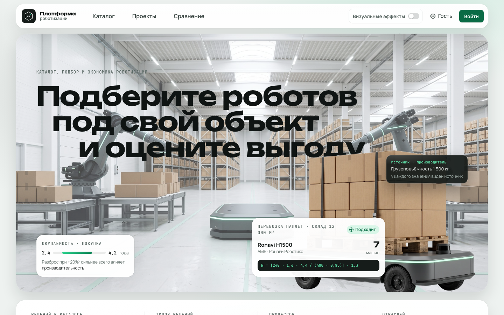

*Рисунок 8.1. Главная страница: три типа объектов, показатели каталога, вход в проекты.*

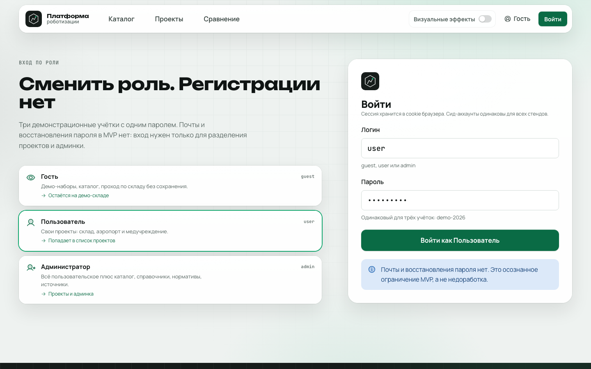

*Рисунок 8.2. Форма входа с тремя демо-ролями.*

## 8.2. Каталог

1. Раздел «Каталог»: слева дерево «отрасль → объект → процесс → тип решения», сверху поиск, справа список карточек.
2. Кнопка «В сравнение» на карточке добавляет робота в общий список сравнения (счётчик в верхнем меню).
3. Карточка робота показывает характеристики. Рядом с каждым значением буква достоверности A–D; по наведению видны источник, ссылка и цитата.

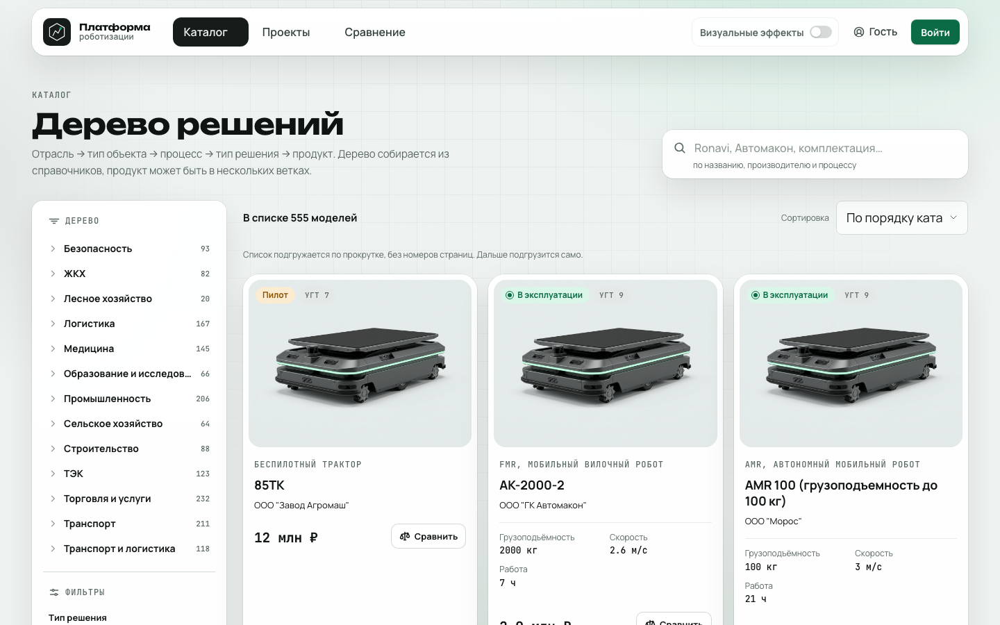

*Рисунок 8.3. Каталог: дерево, поиск, карточки, кнопка сравнения.*

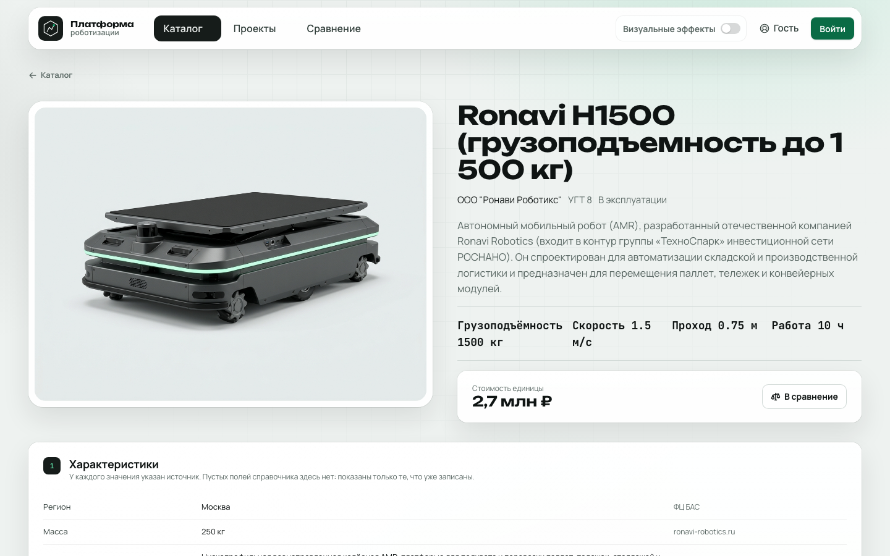

*Рисунок 8.4. Карточка робота с характеристиками и источниками.*

## 8.3. Создание проекта

«Проекты» → «Новый проект»: название, отрасль, объект. Гость может открыть только демо-проекты; создавать проекты может `user` и `admin`.

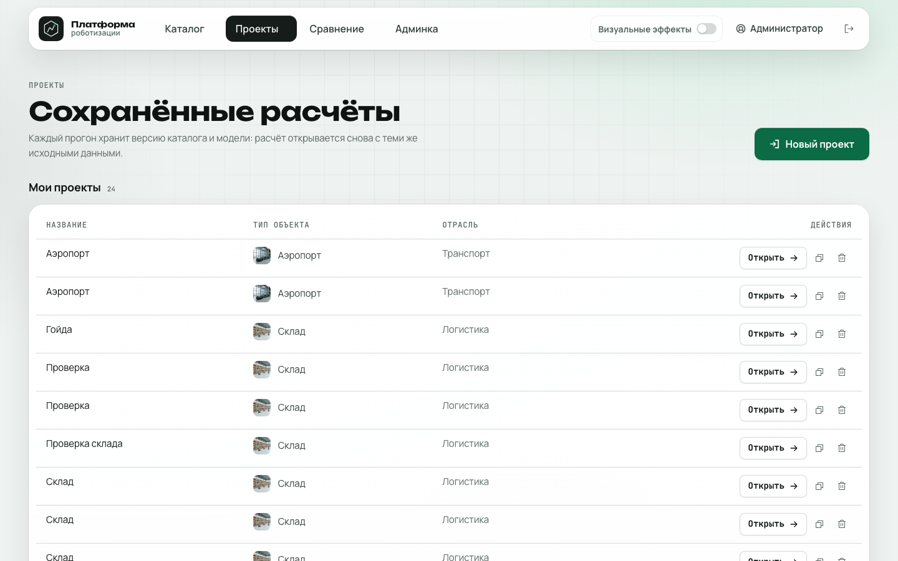

*Рисунок 8.5. Список проектов: свои проекты и опубликованные демо.*

## 8.4. Проход по шагам проекта

Шаги в верхней полосе: **Параметры → Подбор → Сравнение → Экономика → What-if → Визуализация → Отчёт**. Для аэропорта и медучреждения доступны первые три.

### Параметры

Параметры площадки вводятся вручную, кнопкой «Подставить демо-данные» или файлом (шаблоны CSV и Excel, «Загрузить файл»). Вкладка «Процессы объекта» включает и выключает процессы. Пустые поля не отсеивают роботов, но снижают точность подбора.

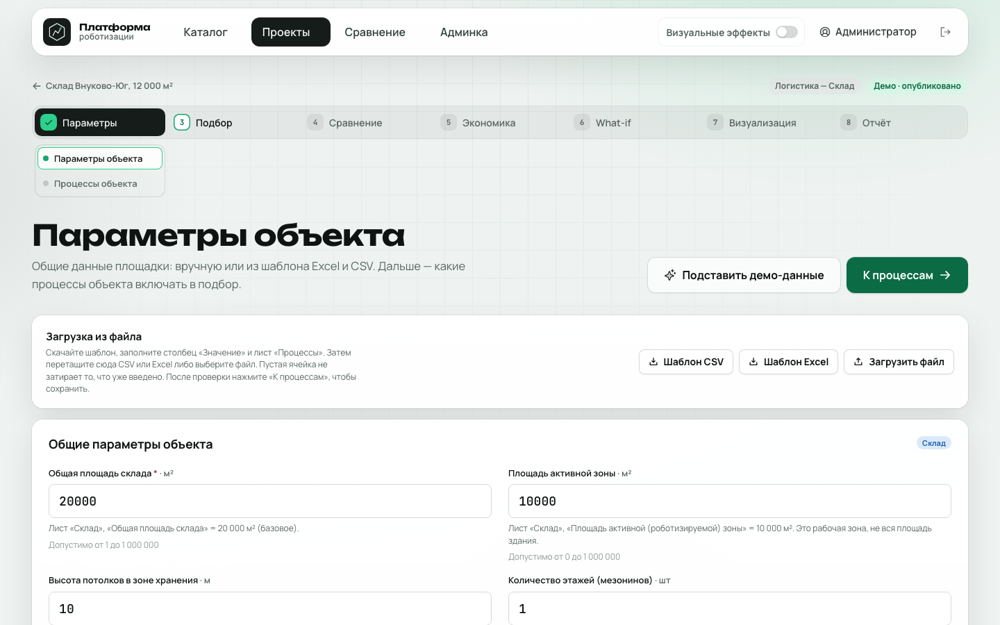

*Рисунок 8.6. Параметры объекта: ручной ввод и загрузка из файла.*

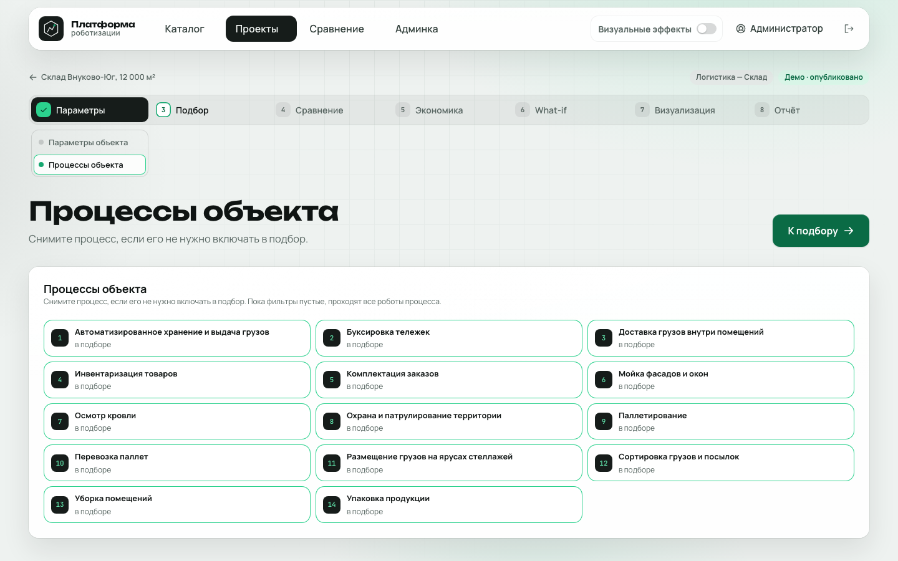

*Рисунок 8.7. Выбор процессов объекта.*

### Подбор

Слева процессы, справа вкладки «Подходит / С условием / Уточнить / Не подходит». В карточке результата видны число роботов, УГТ, стадия и причины вердикта. Роботы, прошедшие фильтры, уже добавлены в сравнение; остальных добавляет кнопка на карточке.

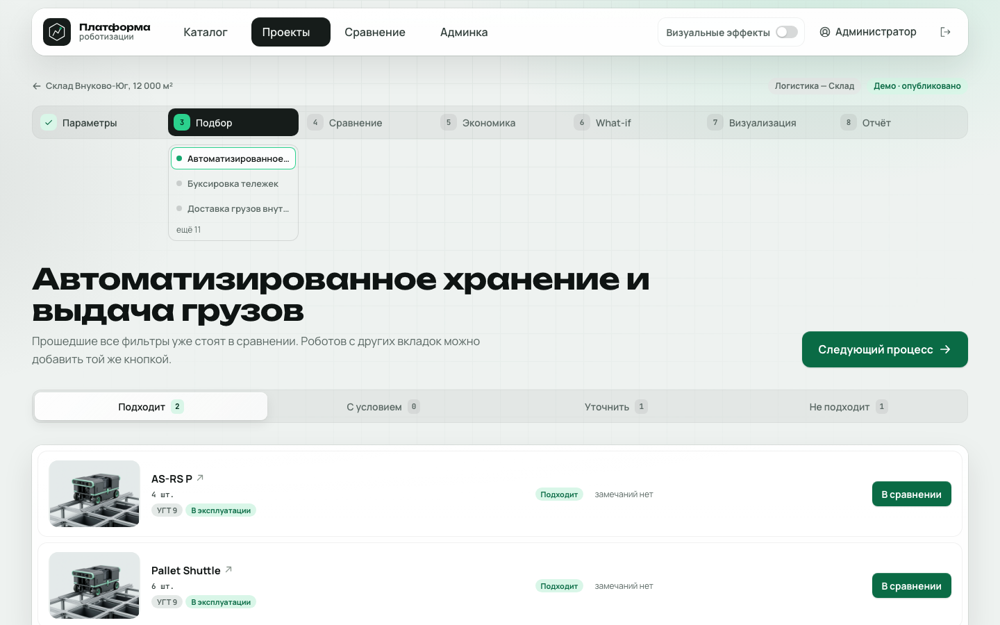

*Рисунок 8.8. Подбор по процессу с вердиктами.*

### Сравнение

Таблица характеристик выбранных роботов по процессу, лучшее значение подсвечено. Здесь пользователь выбирает одного робота на процесс: он идёт в экономику.

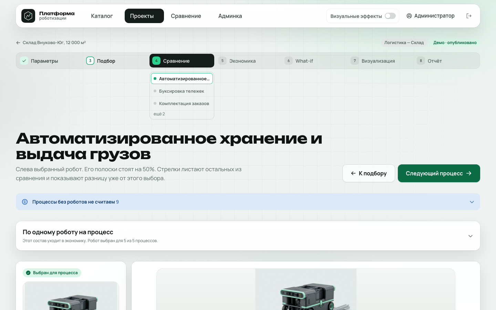

*Рисунок 8.8а. Сравнение роботов процесса.*

### Экономика

Три сценария: без роботизации, покупка, аренда. По клику на число раскрываются формула, подстановка и источники значений. Внизу таблица чувствительности и переключатели мер господдержки.

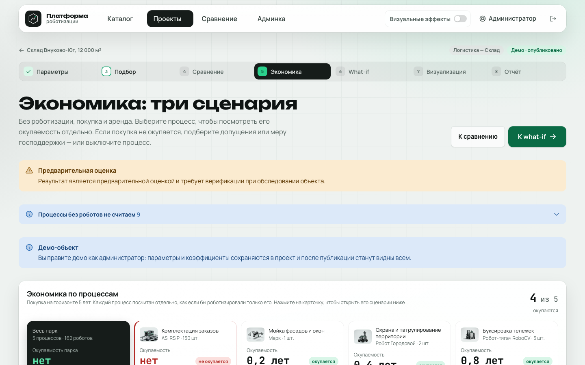

*Рисунок 8.9. Экономика: сводка по процессам и сценариям.*

### What-if

Ползунки нормативов (доля замещаемого персонала, стоимость персонала и оборудования, нагрузка, тариф). Пересчёт мгновенный. «Сохранить для проекта» запоминает значения, «К стандарту» сбрасывает их.

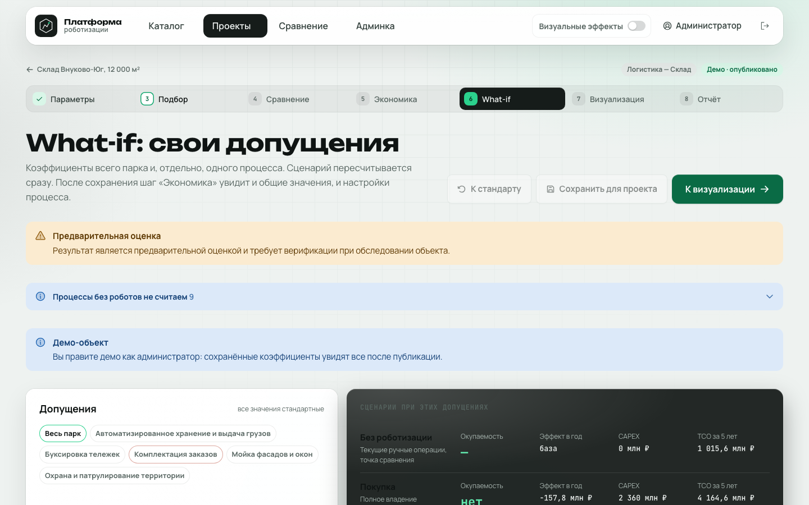

*Рисунок 8.10. What-if: свои допущения и сценарии при них.*

### Визуализация

Редактор схемы в двух режимах: «Здание» (пол, стены, лифты, подложка-чертёж) и «Роботы» (станции и зоны процессов). Затем запуск смены: монитор, маршруты, ползунок потока заданий, кнопка «Сломать». Подробности в разделе 6.

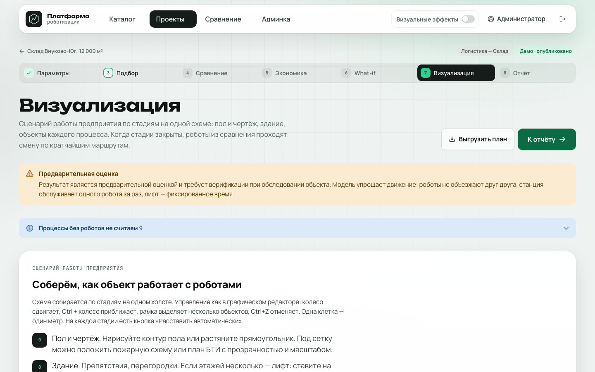

*Рисунок 8.11. Экран визуализации и редактор схемы.*

### Отчёт

Кнопки: печать в PDF, Excel, CSV, схема (PNG). В отчёте вывод о том, какой сценарий выгоднее, таблица сценариев, парк и оговорка о предварительном характере оценки.

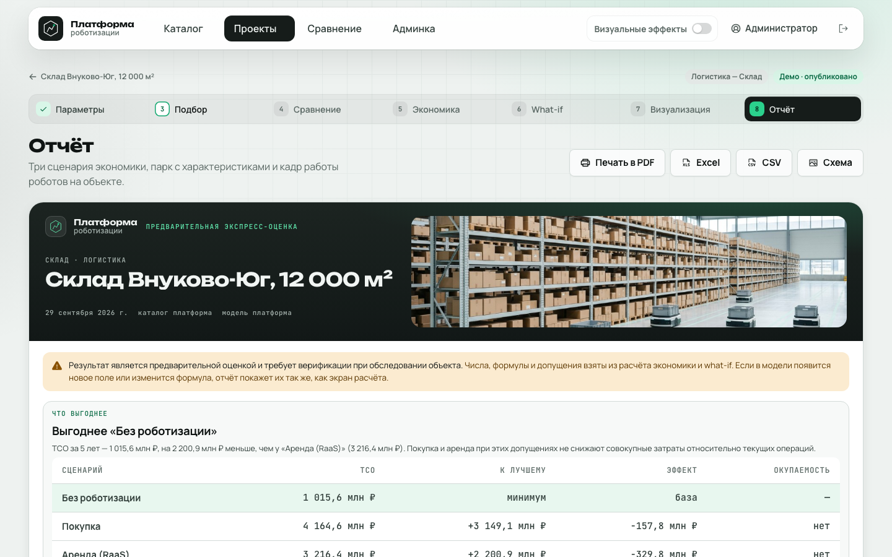

*Рисунок 8.12. Отчёт с выводом и выгрузкой.*

## 8.5. Частые вопросы

| Вопрос | Ответ |
|---|---|
| У большинства роботов «Уточнить» | В карточке нет нужных характеристик (грузоподъёмность, время работы). Заполните их в админке или добавьте робота в сравнение вручную |
| Окупаемости нет | Проверьте состав парка на шаге сравнения: по умолчанию выбирается самый грузоподъёмный робот, а не самый дешёвый. Скорректируйте долю замещаемого персонала (раздел 5.8) |
| Демо не даёт запустить визуализацию | У демо нет сохранённой схемы. Скопируйте проект и нарисуйте схему |
| Изменения демо не сохраняются | Демо редактирует только администратор |
