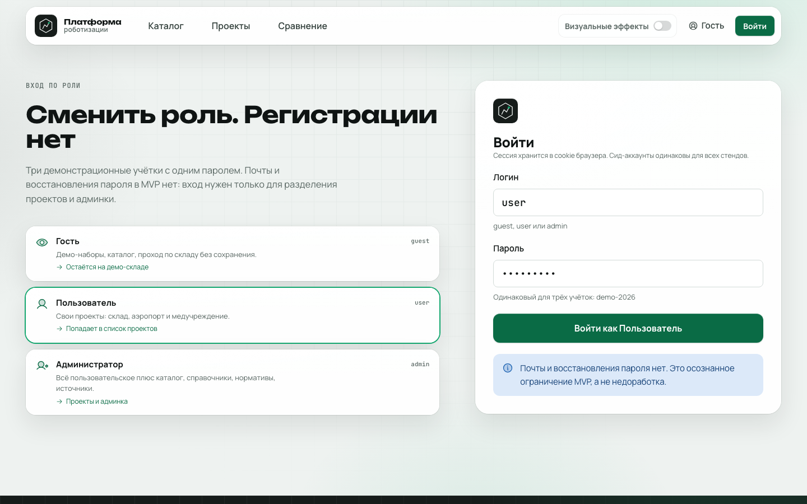
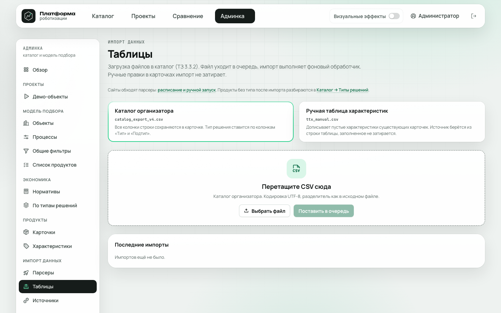
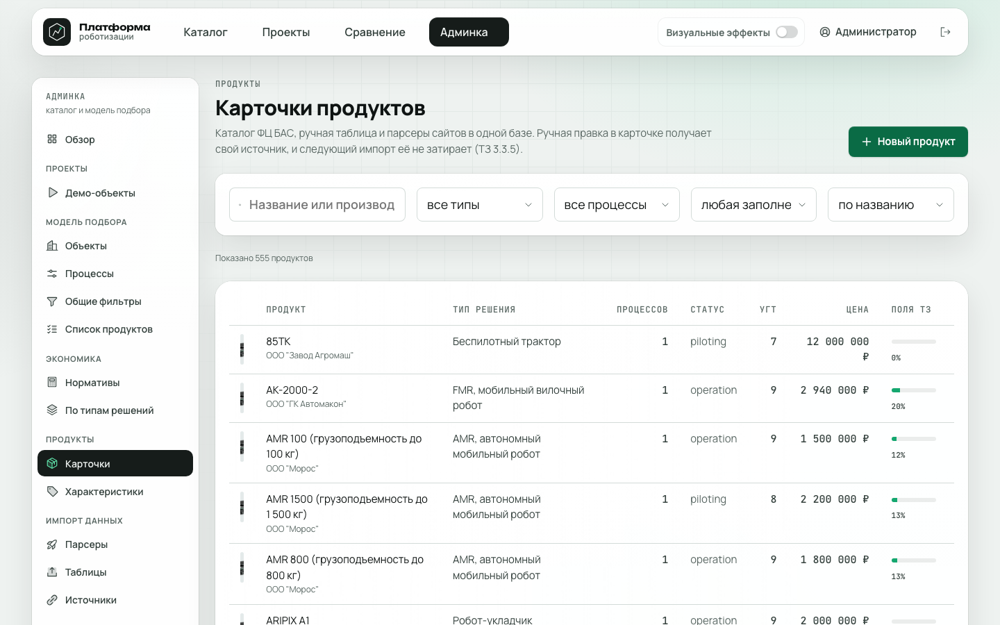
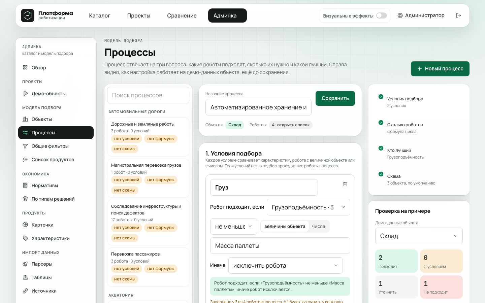
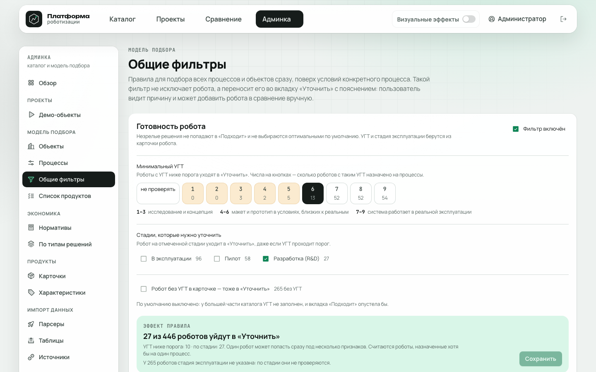
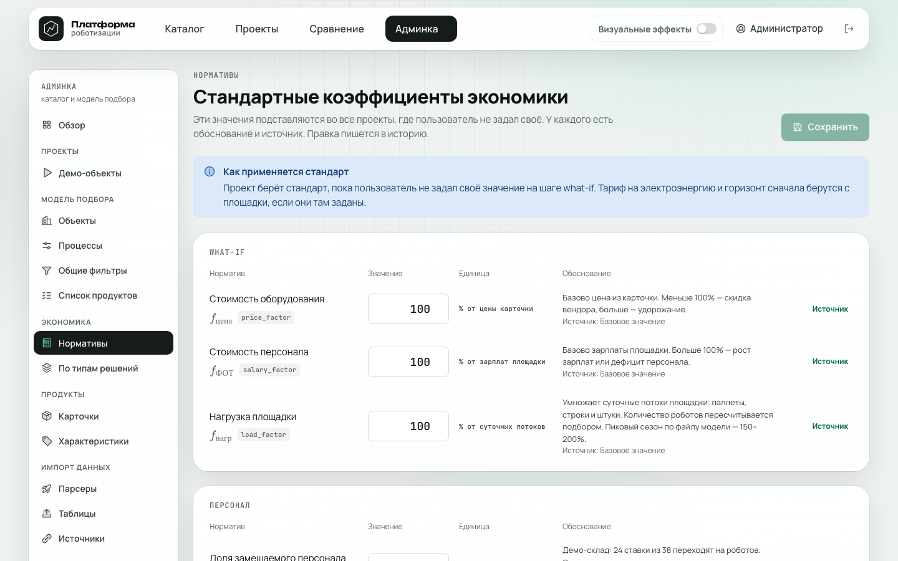
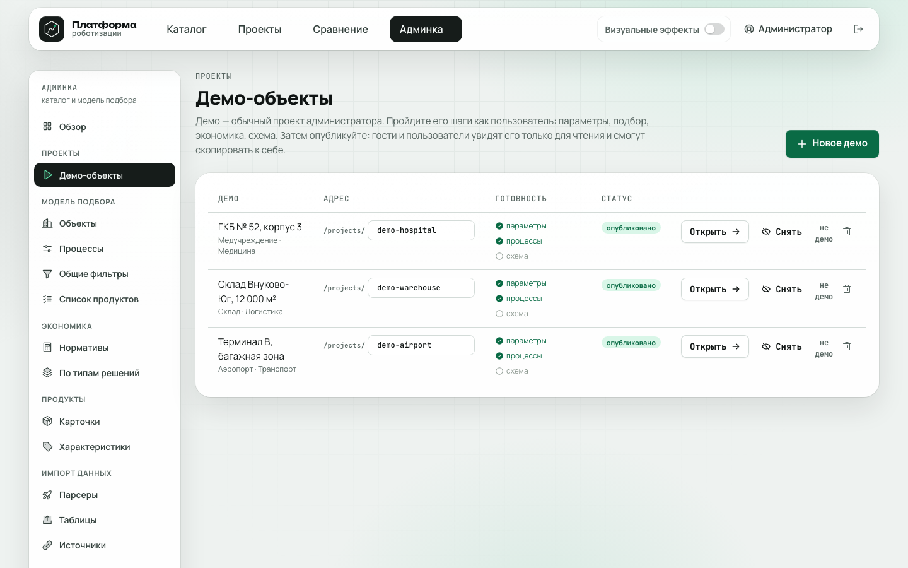

# Раздел 9. Руководство администратора

*Вход: `admin` / `demo-2026`. В верхнем меню появляется «Админка».*

*Рисунок 9.1. Обзор: объёмы каталога и очередь прогонов.*

## 9.1. Разделы

| Группа | Раздел | Что делает |
|---|---|---|
| Проекты | Демо-объекты | Создать демо, задать адрес, опубликовать |
| Модель подбора | Объекты | Поля площадки и процессы объекта |
| | Процессы | Фильтры, формула количества, ключ ранжирования, схема |
| | Общие фильтры | Готовность робота: минимальный УГТ, стадия |
| | Список продуктов | Роботы процесса и каких данных им не хватает |
| Экономика | Нормативы | Значения, источник, заметка к изменению |
| | По типам решений | Свой норматив для типа робота |
| Продукты | Карточки | Правка характеристик, фото, процессы |
| | Характеристики | Подписи, единицы, группы |
| Импорт | Парсеры | Включить, час запуска, запуск вручную |
| | Таблицы | Загрузка CSV каталога и ручной таблицы ТТХ |
| | Источники | Реестр источников и достоверность A–D |
| Каталог | Дерево, Отрасли, Типы решений | Структура каталога, карточки без типа |

## 9.2. Типовые задачи

**Добавить или обновить роботов.** «Таблицы» → загрузить CSV, либо «Парсеры» → «Запустить». Статус виден в обзоре. Затем «Типы решений» → назначить тип карточкам без типа.

*Рисунок 9.2. Загрузка CSV каталога и ручных характеристик.*

**Исправить значение у робота.** «Карточки» → выбрать робота → изменить значение и указать источник. Ручное значение следующий импорт не затирает.

*Рисунок 9.3. Список карточек.*

**Назначить роботу процесс.** Карточка → «Процессы», либо «Список продуктов» у процесса.

**Настроить правило подбора.** «Процессы» → выбрать процесс → добавить фильтр (условие, режим `hard` или `conditional`, входы площадки) или формулу количества. Справа выбранный объект прогоняется автоматически: видно, как подбор сработает на его данных, ничего не сохраняя.

*Рисунок 9.4. Настройка процесса.*

**Изменить порог готовности.** «Общие фильтры»: минимальный УГТ (по умолчанию 6), стадии для «Уточнить».

*Рисунок 9.5. Общий фильтр готовности.*

**Изменить норматив экономики.** «Нормативы» → новое значение, источник, заметка. Запись попадает в журнал. Для отдельного типа робота: «По типам решений».

*Рисунок 9.6. Нормативы экономики.*

**Добавить объект или поле площадки.** «Объекты» → создать объект, выбрать поля и процессы. Новые отрасли: «Отрасли».

**Включить объект в подбор.** В «Объектах» галочка «Подбор решений»: без неё объект нельзя выбрать при создании проекта. Существующие проекты и дерево каталога это не затрагивает.

**Опубликовать демо.** «Демо-объекты» → создать проект, заполнить параметры, включить публикацию. Демо видно всем, менять его может только администратор.

*Рисунок 9.7. Демо-объекты.*

## 9.3. После правок

- Подбор и экономика во всех проектах пересчитываются сразу, снимков нет.
- После крупной загрузки выполните `make audit-platform` (раздел 7.3).
- Пароли демо-записей и `SESSION_SECRET` сменить до публичного запуска (раздел 3.6).
