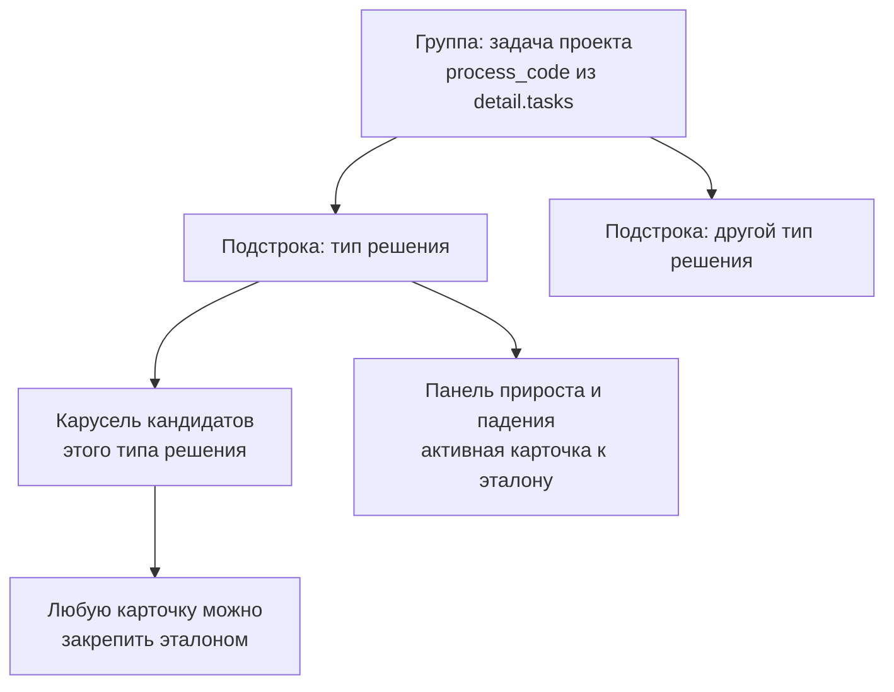

# E4: путь ТЗ и шаг сравнения

Контракт для параллельной работы. Всё, что здесь описано, обязательно к исполнению буквально: агенты работают одновременно и видят друг друга только через этот документ.

Предыдущий контракт — [E3_SPEC.md](E3_SPEC.md). Его принципы продолжают действовать, в первую очередь §0.

## §0. Принципы

1. **Ни одного недокументированного числа.** Любое число в интерфейсе либо пришло из источника каталога, либо посчитано движком и имеет запись в трассировке, либо объявлено в файле в `data/` с обоснованием. Коэффициентов в коде не бывает.
2. **Отсутствие данных называется отсутствием.** Пустое значение не превращается в ноль, в прочерк без пояснения или в среднее по больнице. Формулировка: «нет данных», плюс у кого именно их нет.
3. **Заглушка обязана быть видимой.** Если шаг не считается, он это говорит. Кнопка, которая ничего не делает, помечена как заглушка и не притворяется рабочей.
4. **Мы не сравниваем несравнимое.** Дельта считается только между двумя известными значениями одного параметра в пределах одного типа решения.

## §1. Нумерация шагов по ТЗ

Восемь шагов ТЗ ложатся так. Шаг 1 живёт вне рельса, на странице создания проекта.

| Шаг ТЗ | Маршрут | Состояние после E4 |
|---|---|---|
| 1. Отрасль и объект | `/projects/new` | живой |
| 2. Параметры проекта | `/projects/[id]/params` | живой, загрузка файла — видимая заглушка |
| 3. Подбор решений | `/projects/[id]/match` | живой |
| 4. Сравнение | `/projects/[id]/compare` | живой, новое |
| 5. Расчёт экономики | `/projects/[id]/economics` | заглушка, состав парка на `/scenarios` |
| 6. What-if | `/projects/[id]/what-if` | заглушка, помечена как демонстрация |
| 7. Визуализация | `/projects/[id]/plan` | заглушка |
| 8. Сохранение и экспорт | `/projects/[id]/report` | печать живая, выгрузки — видимые заглушки |

Рельс внутри проекта — семь пунктов с номерами от 2 до 8: параметры, подбор, сравнение, экономика, what-if, визуализация, отчёт. Сценариев в рельсе нет, это часть шага 5.

## §2. `GET /api/v1/catalog/attrs`

Массовая выдача характеристик. Нужна затем, что `useCatalog()` собирает карточки без значений, и сравнивать сейчас нечего.

```json
{
  "catalog_version_id": 3,
  "attrs": {
    "fceeacf0-579f-46cc-92ff-2057fea5da7f": {
      "payload_kg": { "status": "known", "value": 12, "unit": "кг", "source_id": 17, "quote": "до 12 кг" },
      "charge_time_h": { "status": "unknown", "value": null }
    }
  }
}
```

Значение — ровно `engine.models.AttrValue`, тот же тип, что в `ProductDetail.attrs`. Ключ внешнего словаря — строковый UUID продукта.

Требования:

- отдаются все продукты каталога, включая те, у кого заполненных значений нет: для них пустой словарь
- значения со статусом `unknown` включаются: интерфейсу нужно отличать «не знаем» от «не спрашивали»
- источник запроса — та же выборка, что у `product_detail`, но одним проходом: N+1 запросов недопустим
- endpoint не принимает параметров. Во всём каталоге около тысячи заполненных значений, фильтровать нечего

## §3. `GET /api/v1/catalog/compare-spec` и `data/compare_spec.json`

Файл объявляет, что и в какую сторону сравнивается. Endpoint читает его через `get_settings().data_dir` — тем же способом, каким `projects.py` читает профили площадок, без сида и без миграции.

```json
{
  "_note": "Параметры шага 4. Направление better объявляется здесь, чтобы в коде сравнения не было ни одного неявного знака.",
  "params": [
    {
      "key": "count",
      "label": "Количество единиц",
      "unit": "шт",
      "group": "operational",
      "origin": "engine",
      "better": "min",
      "rationale": "Меньше единиц на тот же поток — меньше парк, площадь под зарядные станции и обслуживание."
    },
    {
      "key": "payload_kg",
      "label": "Грузоподъёмность",
      "unit": "кг",
      "group": "technical",
      "origin": "attr",
      "better": "max",
      "rationale": "Запас по грузоподъёмности закрывает нештатную тару без замены парка."
    }
  ]
}
```

Поля записи:

- `key` — ключ характеристики из `data/attributes.json` при `origin: "attr"`, либо расчётная величина при `origin: "engine"`
- `group` — `technical`, `operational` или `economic`. Ровно три группы, как в формулировке шага 4 ТЗ про технические, эксплуатационные и экономические характеристики
- `origin` — `attr` (значение из `GET /catalog/attrs`), `engine` (из ответа расчёта), `derived` (считается по формуле, см. ниже)
- `better` — `max`, `min` или `none`. При `none` параметр показывается без окраски и без знака: он информирует, но не выигрывает и не проигрывает
- `rationale` — непустая строка, объясняющая выбор направления. Пустой `rationale` — ошибка приёмки

Обязательный состав первой версии. Покрытие указано по фактическому состоянию `data/ttx_manual.csv`, параметры с нулевым покрытием не добавляем.

| key | origin | group | better | покрытие |
|---|---|---|---|---|
| `count` | engine | operational | min | все кандидаты со вердиктом pass |
| `score` | engine | operational | max | все кандидаты со вердиктом pass |
| `reliability` | engine | operational | max | всегда, буква A-D |
| `data_completeness` | engine | operational | max | всегда |
| `payload_kg` | attr | technical | max | 30 |
| `speed_loaded_ms` | attr | technical | max | 27 |
| `throughput` | attr | technical | max | 12 |
| `work_time_h` | attr | operational | max | 28 |
| `charge_time_h` | attr | operational | min | 9 |
| `min_aisle_width_m` | attr | operational | min | 6 |
| `price_rub` | attr | economic | min | из каталога |
| `park_price_rub` | derived | economic | min | считается при известной цене |

`reliability` — буква достоверности значений, участвовавших в расчёте количества этого продукта. Порядок для сравнения: A лучше B лучше C лучше D. Берётся из трассировки шага `size` данного продукта, а при её отсутствии — из достоверности источников его характеристик.

`park_price_rub` — единственная производная величина: `count * price_rub`. Подпись в интерфейсе обязана содержать «только оборудование, без внедрения и сервиса», иначе это выглядит как CAPEX, которого мы не считаем. Если цена неизвестна, параметр показывает «нет данных», а не ноль.

## §4. Правила дельт

Дельта считается между активной карточкой карусели и эталоном подстроки.

1. Оба значения известны и числовые — дельта считается: абсолютная разница в единицах параметра и относительная в процентах от значения эталона. При нулевом эталоне относительную не показываем.
2. Хотя бы одно значение неизвестно — вместо дельты текст «нет данных», плюс уточнение, у кого именно: у активной карточки, у эталона или у обоих.
3. Значение-диапазон (`AttrValue.value` как список из двух чисел) — для дельты берём середину диапазона и помечаем результат как приблизительный.
4. Нечисловые значения (`reliability`) сравниваются по объявленному порядку, дельта выражается словами: «достоверность выше на одну ступень».
5. Знак «лучше» или «хуже» определяется только через `better` из спеки. Если `better` равен `none`, показываем разницу без окраски.
6. Активная карточка совпадает с эталоном — панель говорит «это эталон», дельт нет.

## §5. Сетка шага 4



Группы строятся по задачам проекта в порядке `detail.tasks`, подпись — `labelProcess(process_code, task.name)`. Задача без кандидатов остаётся в сетке с честной строкой, почему направление не закрыто: нет типов решений на процесс, либо все кандидаты в корзинах «требует проверки» и «исключён».

Подстроки внутри группы — типы решений, встречающиеся среди кандидатов этой задачи, по `product.solutionType`. Порядок подстрок — по лучшему счёту внутри.

В карусели — кандидаты со вердиктом `pass`. Кандидаты со вердиктом `unknown` показываются отдельной полосой под каруселью как «требуют проверки, в сравнение не входят»: сравнивать позицию с неизвестными жёсткими полями нельзя, но скрывать её нечестно.

Эталон подстроки по умолчанию — кандидат с максимальным `score`. Закрепление вручную хранится в query-параметре страницы, чтобы ссылка воспроизводила ровно то, что видел человек. Формат: `?pin=<process_code>:<solution_type_code>:<product_id>`, повторяется для каждой закреплённой подстроки.

## §6. Сводка под таблицей

Считается по закреплённым эталонам всех подстрок. Состав обязателен:

- сколько направлений закрыто подбором и сколько нет, с перечислением незакрытых
- суммарный парк: сумма `count` эталонов, с разбивкой по направлениям
- стоимость оборудования по эталонам и у скольких позиций из скольких цена известна. Если цена известна не у всех, сумма подписывается как неполная
- худшая достоверность в наборе и у какого именно решения
- сколько полей ждут ответа вендора, ссылкой на корзину «требует проверки» шага 3
- строка про экономику: окупаемость, TCO и годовой эффект — шаг 5, сейчас заглушка

## §7. `data/field_limits.json` и проверка диапазонов

Шаг 2 ТЗ требует проверять заполненность, формат и допустимые диапазоны. Форматом занимается pydantic, диапазоны объявляются в файле.

```json
{
  "_note": "Границы полей шага 2. Каждая пара получает обоснование: ТЗ 3.5.1 запрещает недокументированные числа.",
  "site": {
    "area_m2": { "min": 1, "max": 1000000, "rationale": "Ниже 1 м² объекта не бывает, выше миллиона — опечатка в разряде." },
    "shift_hours": { "min": 1, "max": 24, "rationale": "Смена не длиннее суток." },
    "shifts_per_day": { "min": 1, "max": 4, "rationale": "Четыре смены по шесть часов — предел режимов из датасета." }
  },
  "task": {
    "flow_per_day": { "min": 0, "max": 10000000, "rationale": "Ноль означает отключённую задачу." }
  }
}
```

Проверка — `model_validator` в `ProjectCreate` и `ProjectPatch` в [backend/api/schemas/project.py](../backend/api/schemas/project.py). Роутеры не меняются: 422 генерирует pydantic. Сообщение об ошибке на русском и называет границу, а не только факт нарушения: «Длительность смены 40 ч выходит за границу 1-24 ч».

Обязательно покрыть все числовые поля `SiteProfile` и `Task`. Поле без записи в файле не проверяется и это не ошибка, но для полей из `siteFieldMeta` записи должны быть все.

## §8. Что остаётся заглушкой

Экономика, what-if, визуализация и выгрузка в Excel и CSV. Требование к ним одно: перестать выглядеть расчётом.

- страница what-if получает явную подпись, что зависимость демонстрационная и коэффициенты не выведены из данных
- кнопки выгрузки в отчёте помечаются как заглушки и остаются неактивными: отчёт собран из моков, выгружать их нельзя
- кнопка загрузки Excel и CSV на шаге 2 добавляется неактивной с подписью, что пока принимается только ручной ввод

Печать в PDF через `window.print()` работает и заглушкой не помечается.

## §9. Разделение зон

Агенты работают одновременно. Файл правит ровно один агент.

| Зона | Файлы |
|---|---|
| Массовые ТТХ и спека | `backend/api/routers/catalog.py`, `backend/api/schemas/catalog.py`, `backend/api/services/catalog.py`, `data/compare_spec.json`, `backend/api/tests/test_catalog_attrs.py` |
| Диапазоны | `backend/api/schemas/project.py`, `backend/api/services/limits.py`, `data/field_limits.json`, `backend/api/tests/test_limits.py` |
| Рельс шагов | `frontend/app/data/projects.ts`, `frontend/app/components/ProjectSteps.vue`, `frontend/app/pages/projects/new.vue`, `frontend/app/pages/projects/[id]/params.vue`, `frontend/app/pages/projects/[id]/economics.vue`, `frontend/app/pages/projects/[id]/scenarios.vue`, `frontend/app/pages/projects/[id]/plan.vue`, `frontend/app/pages/projects/[id]/what-if.vue`, `frontend/app/pages/projects/[id]/report.vue`, `frontend/app/pages/projects/[id]/match.vue` |
| Логика сетки | `frontend/app/composables/useCompareGrid.ts`, `frontend/app/composables/useCatalog.ts`, `frontend/app/types/api.ts`, `frontend/app/data/siteFields.ts` |
| Страница сетки | `frontend/app/pages/projects/[id]/compare.vue` |

`backend/engine/**` в этом заходе не меняется вообще.
